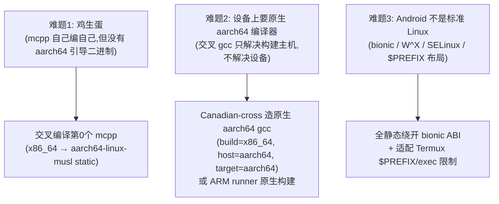
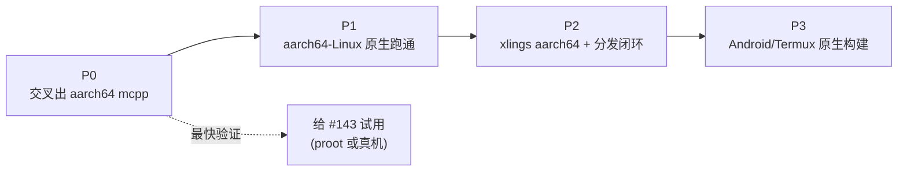

# aarch64 / Android 支持 —— 跨仓库 MVP 顶层设计方案

> 北极星目标:**让 mcpp 在 Android 手机(Termux)上原生运行,并能在手机上构建出 C++ 程序**,全程不依赖 Android 的 bionic libc。
> 本文是**顶层执行方案**(phases / 跨仓库协调 / 验收门)。逐点 file:line 适配清单见 [`todos/2026-06-22-aarch64-linux-ecosystem-support-analysis.md`](todos/2026-06-22-aarch64-linux-ecosystem-support-analysis.md)。
> 日期:2026-06-22。起因:[mcpp#143](https://github.com/mcpp-community/mcpp/issues/143)。

---

## 1. 战略决策(已在分析中定型)

| 决策 | 选择 | 理由 |
|---|---|---|
| **路线** | **musl-static 全静态** | 全静态 = 无 PT_INTERP、无 glibc payload、无 sysroot patch、不碰 bionic;同时绕开 "glibc 能否在 Android 内核跑" 这个变量 |
| **arch token** | `arm64`(非 `aarch64`) | 引擎 `detect_arch_()` 强制;XLINGS_RES 资产必须叫 `…-linux-arm64.tar.gz` |
| **分发** | 复用 `XLINGS_RES` 哨兵 | 引擎自动按 `detect_arch_()` 拼 arch,`.lua` 的 `linux={}` 块**不需改**,只上传资产 |
| **arch 系统** | **暂不做完整三元组** | 现在靠 XLINGS_RES 自动 arch 足够;`abi` 轴(glibc/musl/bionic)比 arch 轴更关键,留到 Android/多 abi 阶段再上 `(os,arch,abi)` target 概念 |
| **toolchain** | `aarch64-linux-musl` gcc-15 | `import std` 需要 gcc≥15;`musl-cross-make.lua` 已支持 15.1.0 + loader 派生已 arch-generic |

### 关键技术事实(支撑可行性)
- `mcpp build` / `pack` **不执行产物**(执行只在 `run`/`test`)→ **交叉编译可行**;代价:x86_64 上不能 `test/run` aarch64 产物。
- musl-static 链接路径 **arch-干净**:`-static` 无 INTERP,glibc loader 硬编码(`flags.cppm:336`、`pack.cppm:648`)都不在此路径上。
- 显式 `--target aarch64-linux-musl` 绕开 `pipeline.cppm:37,61` 的 x86_64 默认 fallback。
- `targetTriple` 来自编译器 `-dumpmachine` → 指向真 `aarch64-linux-musl-g++` 即自动产 aarch64。
- **自举无捷径**:必须先有"第 0 个 aarch64 mcpp"(连 Nix 也需 per-platform bootstrap seed)。

---

## 1b. 工具链包模型(2026-06-22 细化,已部分落地)

把"原生"和"交叉"切成**两个独立的 xim 包**,mcpp 按 host 感知二选一:

| 包 | 语义 | host / target | XLINGS_RES 资产 | 谁用 |
|---|---|---|---|---|
| `musl-gcc`(已存在,需泛化) | **原生** target=host | host=target | `musl-gcc-<ver>-linux-<hostarch>.tar.gz`(host 自动) | 设备端(aarch64→aarch64 在 ARM 上) |
| `aarch64-linux-musl-gcc`(**新增**) | **交叉** target≠host | host=x86_64 / target=aarch64 | `aarch64-linux-musl-gcc-<ver>-linux-x86_64.tar.gz` | x86 上交叉构建 aarch64 |

**mcpp 的 host 感知选择**(`src/build/prepare.cppm` `*-musl` 约定分支,已实现):
- target arch == `mcpp::platform::host_arch` → 原生 → `gcc@15.1.0-musl` → `xim:musl-gcc`
- target arch != host_arch → 交叉 → `<triple>-gcc@15.1.0` → `xim:<triple>-gcc`

配套已实现的 mcpp 改动:
- `src/platform/common.cppm`:新增 `host_arch` 常量(GNU 拼写 `aarch64`,非 xlings 资产用的 `arm64`)。
- `src/toolchain/registry.cppm`:识别目标命名工具链 spec(`*-linux-musl-gcc`)→ 包名即 triple,前端 `<triple>-g++`;`frontend_candidates_for`/`archive_tool` 按 triple 派生。
- `mcpp.toml`:`[target.aarch64-linux-musl]` 不写死 toolchain,交给 host 感知约定。

**Canadian-cross 两步产出序列**(都入 xlings 生态):
```
A. build=x86 host=x86 target=aarch64  → 交叉编译器 → 包 aarch64-linux-musl-gcc
                                         (musl-cross-make,gcc 15.1.0)
B. 基于 A,build=x86 host=aarch64 target=aarch64 → 原生 → musl-gcc 的 arm64 资产
                                         (Canadian-cross,或在 ARM 上原生构建)
```
- A 解决 x86 CI 交叉构建(也用于引导第 0 个 aarch64 mcpp)。
- B 解决设备端原生构建(#143 端用户),产出 `musl-gcc-<ver>-linux-arm64.tar.gz`,经 `musl-gcc.lua` 泛化后由 XLINGS_RES 在 aarch64 host 自动选中。

> 命名要点:交叉包 **必须** 把 target 写进包名(host 维度交给 XLINGS_RES);原生包沿用 `musl-gcc`(host=target,XLINGS_RES 按 host arch 自动区分)。

## 1c. 进展记录(2026-06-22)

**✅ G0 达成 + mcpp 自身交叉编译成功** —— mcpp 在 x86_64 上交叉构建出可运行的 aarch64 静态 ELF,**并交叉编译出 mcpp 本身**(`mcpp-0.0.58-linux-aarch64`,15M 全静态;`qemu-aarch64 mcpp --version` → `mcpp 0.0.58`)。这就是 #143 的可交付二进制(musl 全静态 → 可在 Android/Termux 原生运行,不依赖 bionic)。

验证链:
- 交叉工具链 `aarch64-linux-musl` gcc-15.1.0 经 musl-cross-make 构建成功;直接编译 + `import std` 均产出 `ELF aarch64, statically linked`。
- `mcpp build --target aarch64-linux-musl` 端到端:解析 cross 工具链 → 跨编 std BMI → 静态链接 → `target/aarch64-linux-musl/.../aatest` 为 aarch64 ELF。
- **qemu-aarch64 实际运行通过**;`x86_64-linux-musl` 原生路径回归正常(未破坏)。

落地的代码改动(mcpp):
- `src/platform/common.cppm`:`host_arch` 常量。
- `src/build/prepare.cppm`:host 感知 native/cross 选择。
- `src/toolchain/registry.cppm`:目标命名 spec(`*-linux-musl-gcc`)识别 + triple 派生前端/ar。
- `mcpp.toml`:`[target.aarch64-linux-musl]`(host 感知,无写死 toolchain)。

发现并修复的**交叉正确性 bug**(mcpp 此前把 glibc-gcc 模型套用到 musl 自包含工具链):
- `src/toolchain/gcc.cppm`:std 构建对 musl 跳过外部 binutils `-B`(否则 x86 `as` 报 `unrecognized option '-EL'`)。
- `src/toolchain/stdmod.cppm` + `src/build/flags.cppm`:对 musl 跳过外部 linux-headers `-isystem`(self-contained sysroot 自带,且交叉时 host 头是错 arch)。

xlings 生态侧:
- `xim-pkgindex/pkgs/a/aarch64-linux-musl-gcc.lua`:cross 包(长命令 + gcc-flavor `15.1.0-aarch64-musl` 版本标识)。
- `xim-pkgindex/pkgs/m/musl-cross-make.lua`:target_list 加 `aarch64-linux-musl`。

**已知限制 / 待办**:
- 本次端到端测试用"预装到 xpkgs(`.mcpp_ok`)"绕过下载,因为 **xlings 下载器仅支持 HTTPS,不支持 `file://`**。生产路径 = 把 `aarch64-linux-musl-gcc-15.1.0-linux-x86_64.tar.gz`(411MB,已打包)发到 `https://xlings-res`(GLOBAL github + CN gitcode)。
  - 可选改进:给 xlings downloader 加 `file://` 本地资源支持,利于离线/本地包开发。
- 步骤 B(Canadian-cross 产 host=aarch64 原生 `musl-gcc` arm64 资产)尚未做。
- libcc1 在 install 阶段失败(可选的 GDB 插件,非编译必需);打包时建议 `--disable-libcc1` 去噪。

## 2. 三个根本难题与解法



---

## 3. 分阶段执行方案(MVP → Android)

### 阶段总览



---

### P0 — 交叉构建第 0 个 aarch64 mcpp(打破鸡生蛋)

**目标**:在 x86_64 主机上产出一个 `aarch64-linux-musl` 全静态 mcpp 二进制。

| # | 仓库 | 交付物 |
|---|---|---|
| P0-1 | `xim-pkgindex` | `musl-cross-make.lua` 的 `target_list` 加 `aarch64-linux-musl`(上游原生支持,loader 派生已 arch-generic) |
| P0-2 | (本地) | 用 `xlings run musl-cross-make --target aarch64-linux-musl --gcc 15.1.0` 造出交叉 gcc-15 |
| P0-3 | `mcpp` | 摸清/打通"消费本地交叉工具链"的接法(见 §5 风险①);`mcpp.toml` 加 `[target.aarch64-linux-musl] linkage=static` |
| P0-4 | `mcpp` | `mcpp build --target aarch64-linux-musl` + `mcpp pack --target aarch64-linux-musl` |

**验收门 G0**:`file <out>` → `ELF 64-bit LSB, ARM aarch64, statically linked`;QEMU-user 或 aarch64 box 上能 `--version`。

> 🚀 **此处即可给 #143 报告人最快验证**:把 G0 产物丢进 Termux(原生或 proot)跑 `--version`,证明 self-contained 在 ARM 成立。

---

### P1 — aarch64-Linux 标准发行版原生跑通

**目标**:在真 aarch64 Linux(ARM 服务器 / RPi64 / QEMU / Termux-proot-Ubuntu)上,mcpp 能 `build` 出 hello-world。

| # | 仓库 | 交付物 |
|---|---|---|
| P1-1 | (构建) | **原生 aarch64 gcc-15**:Canadian-cross(build=x86_64,host=aarch64,target=aarch64)或 ARM runner 原生构建 —— 因为编译器要在设备上跑 |
| P1-2 | `mcpp` | 修阻塞运行时的 arch 硬编码:`pipeline.cppm:37,61` 默认 target 按 host 派生;`install.sh:28-38` 加 `Linux-aarch64→linux-arm64` |
| P1-3 | `mcpp` | (建议)`src/platform/common.cppm` 加 `host_arch` 抽象 + `arch→loader` 映射,统一收编散落硬编码 |
| P1-4 | `mcpp` | 顺手修 `doctor.cppm:106`(只认 `std.gcm`,Clang 产 `std.pcm` 误报) |

**验收门 G1**:aarch64 Linux 上 `mcpp build` + 运行一个 `import std` 的 hello-world 成功。

---

### P2 — xlings aarch64 + 分发闭环

**目标**:`xlings install mcpp` 在 aarch64-Linux 上一键拉通完整工具链。

| # | 仓库 | 交付物 |
|---|---|---|
| P2-1 | `xlings` | CI 产出 `xlings-<ver>-linux-arm64.tar.gz`(`ubuntu-24.04-arm` 原生或交叉);`linux_release.sh` 参数化 `ARCH`/`MCPP_TARGET`;`setup_musl_runtime.sh` musl loader 参数化;`installer.cppm:779` os.arch stub 修正 |
| P2-2 | `xlings-res` | 上架 arm64 资产:`mcpp-<ver>-linux-arm64` + 原生 aarch64 musl 工具链(GLOBAL=github + CN=gitcode 双端) |
| P2-3 | `xim-pkgindex` | 各包 `archs={}` 加 `arm64`;走 XLINGS_RES 的包 **块不改**(macOS 已是活证据);仅 `musl-gcc.lua` 需把 `x86_64-linux-musl-*` 程序名泛化 |
| P2-4 | `libxpkg` | `elfpatch.lua` + `xpkg-lua-stdlib.cppm:1181` 加 aarch64 loader 路径(`ld-musl-aarch64.so.1`)—— 供非全静态包用;纯静态可后置 |
| P2-5 | `mcpp` | `release.yml` 加 aarch64 job;`.xlings.json` pin 无需改 arch;README 状态 🔄→✅ |
| P2-6 | (引导) | 把 P0 的引导产物注册成 xim-x-mcpp 的 arm64 资产,完成自举闭环 |

**验收门 G2**:干净 aarch64 Linux 上 `curl install.sh | bash` → `mcpp build` 全程自动,无手工干预。

---

### P3 — Android / Termux 原生构建(北极星)

**目标**:真 Android 手机的 Termux 里,**不进 proot**,mcpp 原生 build + run 出程序。

| # | 仓库 | 交付物 / 攻关点 |
|---|---|---|
| P3-1 | (构建) | **设备上的编译器**:原生 aarch64 musl gcc 要能在 Android 内核跑。优先 **musl-static gcc**(无 loader);退路 musl-dynamic + bundle 极简 `ld-musl-aarch64.so.1` + patch INTERP |
| P3-2 | `mcpp`/`xlings` | Termux 环境适配:`$PREFIX` 路径、`PATH`、Android 10+ 的 **W^X / SELinux exec 限制**(Termux home 可执行,验证下载二进制的 exec 权限链) |
| P3-3 | `mcpp` | std module BMI 在 musl-libstdc++ 上的设备内生成验证(编译期,不需执行) |
| P3-4 | (验证) | 真机:`mcpp new` → `mcpp build` → `mcpp run` 一个 `import std` 程序 |

**验收门 G3**:Android 手机 Termux 原生(无 proot)跑通 `mcpp build && mcpp run`。

> Android **bionic 原生 target**(`android` 平台维度 + NDK 工具链)**不在本方案** —— 那是再大一个量级的独立工程。本方案用 musl-static **在 Android 上但不依赖 bionic** 达成目标。

---

## 4. 跨仓库职责矩阵

| 仓库 | P0 | P1 | P2 | P3 |
|---|---|---|---|---|
| `mcpp` | target 配置 + 工具链消费 | arch 硬编码 + install.sh | release CI | Termux 环境适配 |
| `xim-pkgindex` | musl-cross-make target | — | archs 元数据 + musl-gcc 泛化 | — |
| `xlings` | — | — | CI 产 arm64 + os.arch 修正 | — |
| `xlings-res` | — | — | 上架 arm64 资产 | (设备工具链资产) |
| `libxpkg` | — | — | elfpatch aarch64 loader | (musl loader 验证) |
| (构建基建) | 交叉 gcc | 原生 gcc(canadian-cross) | — | 设备可跑的静态 gcc |

---

## 5. 风险与待确认(决定 P0/P3 成败)

1. **🔴 mcpp 消费"非索引本地工具链"的接法**(P0 阻塞项)
   `[target].toolchain` 走 `to_xim_package` 解析成 xim 包名。本地自建交叉 gcc 怎么喂给 mcpp?——选项:`$CXX`/PATH 让 probe 探到(probe 支持 `$CXX`)/ 包一层薄 xpkg / 临时注册。**P0 第一步先确认这条。**

2. **🟡 import std 跨/原生 BMI**
   gcc-15 musl 必须带 libstdc++ 的 `bits/std.cc` + `include/c++/15/aarch64-linux-musl/` 目标头(musl-cross-make 会编 libstdc++,应有,需实测)。

3. **🟡 设备上 gcc 可跑性**(P3 核心)
   musl-static gcc 最稳;若只能 musl-dynamic,需 bundle loader + 验证 Android exec 限制。这是 P3 唯一的真不确定点。

4. **🟢 abi 校验**
   mcpp 唯一依赖 `mcpplibs.cmdline` 无 `abi:glibc`,musl-static 不冲突。

5. **🟢 ARM runner 可用性**
   GitHub `ubuntu-24.04-arm` 是否对本 org 可用,决定 P1/P2 走原生还是交叉。

---

## 6. 最小关键路径(MVP 主线)

```
P0(交叉 mcpp)→ G0 给 #143 验证
   └─ 阻塞先解:风险①(工具链消费接法)
P1(原生 aarch64-Linux 跑通)→ G1
P2(xlings + 分发闭环)→ G2  ← 标准 aarch64-Linux 用户可用
P3(Android 原生)→ G3        ← 北极星达成
```

**建议节奏**:先做 P0 的 P0-1 + 风险①探路(轻量),确认接法后再启动耗时的 gcc 构建;G0 一旦达成立即给 #143 闭环反馈,再推 P1→P3。

---

## 7. 关联文档
- 逐点 file:line 适配清单 + 拓扑图:[`todos/2026-06-22-aarch64-linux-ecosystem-support-analysis.md`](todos/2026-06-22-aarch64-linux-ecosystem-support-analysis.md)
- 既有平台支持参考:`2026-05-16-macos-support-design.md`、`platform-abstraction-plan.md`
- 发布闭环:记忆 [[release-publish-pipeline]]
</content>
