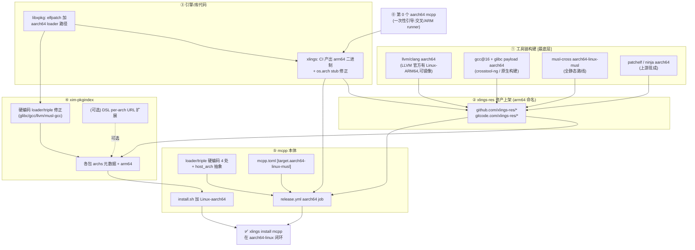
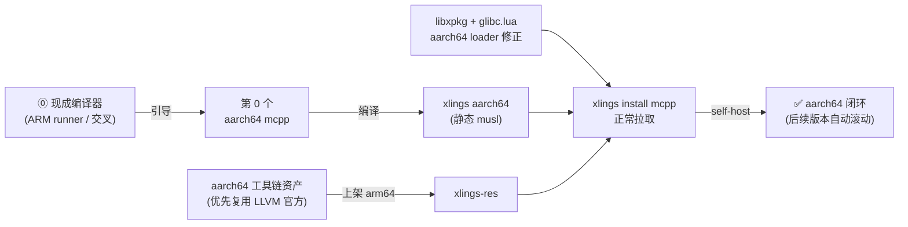
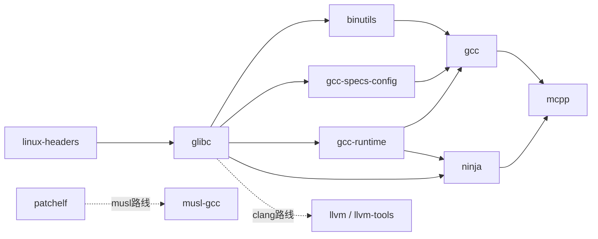

# aarch64-linux 生态适配分析报告

> 起因:[mcpp#143](https://github.com/mcpp-community/mcpp/issues/143) —— 用户在 Android/Termux (aarch64) 上无法编译 mcpp。
> 范围:让 mcpp 及其工具链生态在 **aarch64-linux** 上可安装、可自举、可构建。
> 状态:分析 / 方案(未动代码)。日期:2026-06-22。

---

## 1. 背景与结论速览

mcpp 是一个 **self-host**(自己编译自己)的 C++ 构建/包管理工具。它本身不携带 LLVM,而是通过 bundled 的 **xlings** 包管理器下载托管的 sandbox 工具链(gcc/glibc/llvm 等),并用 patchelf 把 loader/RUNPATH 重写成 sandbox 内的绝对路径。因此 mcpp 的正常工作流 **不依赖宿主 OS 的 libc**。

### 1.1 issue #143 的误区澄清

用户在 Termux 上遇到的 `import std` / Bionic 头冲突(`sigcontext`/`sigaction` 重定义),是因为他 **绕开 mcpp、直接用系统 clang** `-fmodules` 去啃 Bionic 头 —— 那不是 mcpp 的执行路径。mcpp 如果正常跑,Bionic 根本不参与。

### 1.2 核心结论

| 目标 | 难度 | 本质 |
|---|---|---|
| **A. aarch64-linux (glibc/musl)** | 中等、可控 | mcpp 的 triple 检测本就架构无关;真正阻塞 = 少量硬编码 loader + CI 矩阵 + **外部需产出 aarch64 工具链二进制并上架** |
| **B. Termux/Android (bionic)** | 大一个量级 | 全生态零 Android 处理;`__linux__` 与 glibc 强绑定。**取巧路线**:走 `aarch64-linux-musl` 全静态,绕开 bionic ABI 与 "glibc 能否在 Android 内核运行" 两个变量 |

本报告聚焦 **目标 A**;目标 B 在 §7 单列。

### 1.3 三条决定形态的机制(务必先理解)

1. **xlings 按 OS 解析依赖,不按 arch 解析。** 包选择 key 是 `linux/macosx/windows`,`archs={...}` 字段引擎根本不读(纯元数据)。
2. **arch 只在两处真正参与:**
   - `XLINGS_RES` sentinel → 下载 URL 的 arch token 拼接(`xlings/src/core/xim/installer.cppm:146` `build_xlings_res_url_`,按 `detect_arch_()` 自动带);
   - `libxpkg` 的 `elfpatch.lua` 给 ELF 打 INTERP/rpath 时的 loader 选择。
3. **`XLINGS_RES` 包的 per-arch 已天然工作** —— 引擎已自动把 arch 拼进 URL。所以走 sentinel 的工具链包 **无需改 DSL**,只需上架 arm64 资产。DSL "不支持同平台 per-arch URL"(`xim-pkgindex/docs/spec/url-template.md:69`)只卡 **写显式上游 URL** 的包(如 fish/jq)。

### 1.4 命名决策(贯穿全局,必须统一)

引擎 `detect_arch_()`(`xlings/src/core/xim/installer.cppm:123-133`)对 aarch64 返回 **`arm64`**(不是 `aarch64`)。
→ **所有 XLINGS_RES 资产必须命名 `<pkg>-<ver>-linux-arm64.tar.gz`**,内层目录同名。
→ install.sh 的 PLAT 也映射成 `linux-arm64`。
> 注意:mcpp 内部的 **target triple**(由编译器 `-dumpmachine` 产出)仍是 `aarch64-linux-gnu` / `aarch64-linux-musl` —— 这是工具链三元组,与 xlings 资产 token `arm64` 是两套命名,不要混淆。

---

## 2. 涉及的仓库地图

| 仓库 | 角色 | 适配性质 |
|---|---|---|
| `mcpp-community/mcpp` | 本体(self-host 构建工具) | 代码 + CI + 配置 |
| `openxlings/xlings` | 包管理器引擎(C++23,由 mcpp 编译) | 主要是 CI 产出 aarch64 二进制 |
| `mcpplibs/libxpkg` | xlings 的 ELF patch / xpkg 执行库 | 代码(loader 路径) |
| `openxlings/xim-pkgindex` | 包索引(每包一个 .lua) | 元数据 + 硬编码 loader + (可选)DSL 扩展 |
| `xlings-res/*` | 资产托管(GitHub GLOBAL + gitcode CN) | 上架 arm64 二进制 |
| (横切) 工具链构建 | gcc/glibc/llvm/musl 的 aarch64 产出 | **最重的底层活** |

---

## 3. 适配依赖拓扑图(mermaid)

### 3.1 全景:仓库/产物级依赖



### 3.2 自举链路:打破鸡生蛋



### 3.3 工具链包安装依赖顺序(gcc 主链)



---

## 4. 按依赖关系排序的适配点清单

> 图例:`[构建]` 需为 aarch64 重新编译 · `[资产]` 需上架二进制 · `[代码]` 源码改动 · `[CI]` 流水线 · `[决策]` 需拍板

### 阶段 ⓪ — 自举引导(打破鸡生蛋)

- [ ] `[构建]` 在 aarch64 上(`ubuntu-24.04-arm` 原生 runner 或 x86_64 交叉)用现成编译器引导出 **第 0 个 aarch64 mcpp**。参考已有 `scripts/bootstrap-macos.sh` + `.github/workflows/bootstrap-macos.yml` 的 xmake "Plan B" 思路。

### 阶段 ① — 工具链构建(最底层,横切)

- [ ] `[构建]` **llvm/clang aarch64-linux** —— LLVM 官方有 `…-Linux-ARM64` release,**直接镜像最省事**;走此路 `import std` 也通。
- [ ] `[构建]` **gcc@16(glibc)+ glibc payload aarch64** —— crosstool-ng / 原生构建。
- [ ] `[构建]` **musl-cross `aarch64-linux-musl`** —— 全静态路线关键(也是 Termux 取巧路线的基础)。
- [ ] `[构建]` **patchelf / ninja aarch64** —— 上游现成,镜像即可。

### 阶段 ② — xlings-res 资产上架(`arm64` 命名)

向 `github.com/xlings-res/<pkg>`(GLOBAL)+ `gitcode.com/xlings-res/<pkg>`(CN)各上传 `<pkg>-<ver>-linux-arm64.tar.gz`(内层目录同名,布局对齐 x86_64):

- [ ] `[资产]` **最小主链**:`linux-headers` → `glibc` → `binutils` → `gcc-specs-config` → `gcc-runtime` → `gcc` → `ninja` → `mcpp`
- [ ] `[资产]` **补充**:`llvm` / `llvm-tools`(clang / `import std` 路线)、`patchelf`、`musl-gcc` / `musl-cross-make`(musl 路线)

### 阶段 ③ — 引擎/库代码

**`mcpplibs/libxpkg`**(ELF 安装后能否运行的关键)

- [ ] `[代码]` `src/lua-stdlib/xim/libxpkg/elfpatch.lua` —— ELF class 检测已支持 aarch64(`_EM_AARCH64`,:153)✓;但 `_detect_system_loader`(:287-289)与 subos `_resolve_loader`(:315-317)**只列 x86_64 loader** → 补 `ld-linux-aarch64.so.1` / `ld-musl-aarch64.so.1`。
- [ ] `[代码]` `src/xpkg-lua-stdlib.cppm:1181` —— 同逻辑的**内嵌副本**,同步改。

**`openxlings/xlings`**(几乎不阻塞)

- [ ] `[代码]` `src/core/xim/installer.cppm:779` —— Lua `os.arch` stub 硬编码 `'arm64'`,既存疑点,改为反映 `detect_arch_()` 真值。
- [ ] `[CI]` `tools/linux_release.sh:26,45` —— `ARCH` / `MCPP_TARGET` 参数化(`arm64` / `aarch64-linux-musl`)。
- [ ] `[CI]` `.github/workflows/release.yml` —— 新增 `build-linux-arm64` job(`runs-on: ubuntu-24.04-arm`),加进 release `files:`。
- [ ] `[CI]` `tools/setup_musl_runtime.sh:7-26` —— musl loader/SDK 路径参数化(`ld-musl-aarch64.so.1`)。
- [ ] `[CI]` `xlings-ci-linux*.yml` —— 可选 aarch64 矩阵。

### 阶段 ④ — xim-pkgindex(包索引)

**D-1. 必改的硬编码 loader/triple**(install/config 钩子,被 elfpatch 直接消费)

- [ ] `[代码]` `pkgs/g/glibc.lua:33,40-42` —— `loader=lib64/ld-linux-x86-64.so.2`、`abi=linux-x86_64-glibc`、库清单 → aarch64 版(`lib/ld-linux-aarch64.so.1` / `linux-arm64-glibc`)。**不改会打错 INTERP。**
- [ ] `[代码]` `pkgs/g/gcc.lua:81,106-108,169` —— `x86_64-linux-gnu-*` triple + `ld-linux-x86-64.so.2` → arch 派生 `aarch64-linux-gnu-*`。
- [ ] `[代码]` `pkgs/g/gcc-specs-config.lua:48,76-77,87` —— `old_dynamic_linker` 表加 aarch64 项,消除 `:87` 的 `multi-arch?` TODO。
- [ ] `[代码]` `pkgs/g/gcc-runtime.lua:67` —— 内层目录名 arch 化。
- [ ] `[代码]` `pkgs/l/llvm.lua:117,124,142-143,165,256` —— 内层目录 + triple `x86_64-unknown-linux-gnu` + 链接器 → aarch64。
- [ ] `[代码]` `pkgs/l/llvm-tools.lua:24-25` —— url 表 arch 化。
- [ ] `[代码]` `pkgs/m/musl-gcc.lua:59-79,83,162-167,225` —— **改动最大**,整套 `x86_64-linux-musl-*` + `ld-musl-x86_64.so.1` → `aarch64-linux-musl-*`。
- [ ] `[代码]` `pkgs/m/mcpp.lua:41`、`pkgs/p/patchelf.lua:39` —— `url_template` 写死 x86_64,**仅影响 CI version-check**,install 走 XLINGS_RES。

**D-2. 元数据**

- [ ] `[代码]` 各包 `archs={...}` 加 `arm64`(gcc/glibc/binutils/ninja/patchelf/linux-headers/gcc-runtime/llvm-tools 当前只 `{x86_64}`)。

**D-3. 委托型**

- [ ] `[构建]` `pkgs/l/linux-headers.lua` —— 委托 `scode:linux-headers`,需源包提供 aarch64 内核头(`asm/`)。

**D-0. (可选/长期)DSL 引擎扩展 per-arch URL**

- [ ] `[决策]``[代码]` `xim-pkgindex/docs/spec/url-template.md:69` 列为 TODO。两种形态择一:
  - 形态 A(推荐):让显式 URL 也支持 `{arch}` 占位 + 引擎按 `detect_arch_()` 填(与 XLINGS_RES 同源)。
  - 形态 B:新增平台 key `linux-aarch64`(沿用 `ubuntu={ref="linux"}` 继承哲学),引擎识别。
  - 注:mcpp 工具链链几乎全走 XLINGS_RES,此项主要为将来镜像上游显式 URL 的包铺路,**非主链阻塞**。

### 阶段 ⑤ — mcpp 本体

**安装入口**

- [ ] `[代码]` `install.sh:28-38` —— `case` 加 `Linux-aarch64) PLAT="linux-arm64" ;;`(映射 `arm64`),改行 33 文案。

**生产代码硬编码 loader/triple**

- [ ] `[代码]` `src/platform/linux.cppm:85` —— runtime lib dir 写死 `x86_64-unknown-linux-gnu` → 按探测 triple 拼。
- [ ] `[代码]` `src/build/flags.cppm:336` —— `--dynamic-linker` 写死 `ld-linux-x86-64.so.2` → arch 派生 `ld-linux-aarch64.so.1`。
- [ ] `[代码]` `src/pack/pack.cppm:648` —— PT_INTERP 写死 `/lib64/ld-linux-x86-64.so.2` → `/lib/ld-linux-aarch64.so.1`(且不在 `/lib64`)。
- [ ] `[代码]` `src/pack/pipeline.cppm:37,61` —— pack 默认 target 写死 `x86_64-linux-musl` → 按 host 推导。
- [ ] `[代码]` `src/toolchain/post_install.cppm`(93/115/118/146/249/306/319)、`src/toolchain/lifecycle.cppm`(382/387/406/407)—— glibc loader 名 + `x86_64-*` triple 目录(patchelf/specs/cfg 修复链)→ arch 派生。
- [ ] `[代码]` **建议新增** `src/platform/common.cppm` 的 `host_arch` 抽象 + `arch→loader` 映射表,统一上面所有点(当前只有 OS 维度,无 CPU arch 维度)。

**配置**

- [ ] `[代码]` `mcpp.toml:24` —— 新增 `[target.aarch64-linux-musl]`(前提:xlings 有 aarch64 musl-gcc)。
- [ ] `.xlings.json:3` —— bootstrap pin 纯版本号,**无需改 arch**(前提:xim-x-mcpp 有 arm64 资产)。

**发布/CI**

- [ ] `[CI]` `.github/workflows/release.yml` —— 新增 aarch64 job(`runs-on: ubuntu-24.04-arm`)或 matrix;改行 102(xlings 引导下载)、127/131/143-146(`--target`/资产名)、165-168(别名)、248-256(`files:`)。
- [ ] `[CI]` `ci-linux.yml` / `ci-fresh-install.yml` —— 可选 aarch64 leg。
- [ ] `[代码]` `README.md:215` / `README.zh-CN.md:215` —— `Linux aarch64` 状态 🔄→✅。

**测试夹具**

- [ ] `[代码]` `tests/unit/*`、`tests/e2e/*.sh` 多处断言 `x86_64-linux-*` 路径 → 参数化或加 aarch64 用例。

**顺手 bug**(非 arch,但影响所有 Clang 宿主)

- [ ] `[代码]` `src/doctor.cppm:106` —— std 模块检查只认 `std.gcm`,Clang 产 `std.pcm` 会误报。

---

## 5. 最小可用路径(MVP)

只为跑通 gcc 路线的 `xlings install mcpp` + `mcpp build`:

```
⓪ 引导第0个 aarch64 mcpp
 → ① 构建 gcc/glibc/binutils/ninja aarch64(linux-headers 走 scode)
 → ② 上架 arm64 资产(8 个最小主链包)
 → ③ libxpkg elfpatch + glibc.lua loader 修正
 → ⑤ mcpp 4 处硬编码 + install.sh + release.yml aarch64 job
```

llvm(clang/`import std`)、musl-gcc、DSL 扩展可作为第二阶段。

---

## 6. 关键技术依据(代码出处)

| 结论 | 出处 |
|---|---|
| 引擎 arch token = `arm64` | `xlings/src/core/xim/installer.cppm:123-133` `detect_arch_()` |
| XLINGS_RES 自动拼 arch | `xlings/src/core/xim/installer.cppm:146` `build_xlings_res_url_` |
| 依赖解析只按 OS 不按 arch | `xlings` resolver/catalog/index 全用 `platform` key |
| DSL 不支持同平台 per-arch URL | `xim-pkgindex/docs/spec/url-template.md:69-72` |
| elfpatch loader 只列 x86_64 | `libxpkg/.../elfpatch.lua:287-289,315-317` |
| mcpp 二进制全静态(musl) | `mcpp/mcpp.toml:24-26` `[target.x86_64-linux-musl] linkage=static` |
| mcpp 静态链接不挂 glibc payload | `mcpp/src/build/flags.cppm:322-323` |
| triple 由 `-dumpmachine` 动态产出 | `mcpp/src/toolchain/probe.cppm:260-269` |

---

## 7. Termux/Android (bionic) —— 单列

目标 A(aarch64-linux)做完,**在 Termux 原生(bionic)上仍不能直接用**,因为 Android 用 bionic libc,与 glibc/musl ABI 不兼容,且全生态零 `android` 平台维度。

**额外阻塞:**
1. xlings/xim-pkgindex 需新增 `android`/`termux` 平台 key(改 `src/platform/`、所有 `entries.find(platform)`、索引数据)。
2. ELF loader 完全不同(`/system/bin/linker64`、Termux `$PREFIX/lib`),elfpatch 的 ld-linux 假设全失效。
3. sysroot 在 `$PREFIX`,glibc 探测(`/usr/include`、`features.h`、`/lib64`)全不成立。
4. 工具链需 NDK `aarch64-linux-android` 或 Termux 自身工具链。

**推荐取巧路线:** 优先做 **`aarch64-linux-musl` 全静态** —— 产物和工具链全静态,**同时绕开 bionic ABI 和 "glibc 能否在 Android 内核运行" 两个变量**。代价是 `musl-gcc.lua` 那套三元组/loader 改动量大(§4 D-1)。

**给 #143 报告人的最快验证:** 出一个 `aarch64-linux-musl` 全静态 mcpp,让其在 Termux 原生直接跑(不进 proot)试探;或先用 aarch64-linux glibc 包在 proot-distro(Ubuntu)里验证 self-contained 路线成立。

---

## 8. 风险与待确认

- [ ] LLVM 官方 `Linux-ARM64` libc++ 是否带 `std.cppm` + `-print-library-module-manifest-path`(决定 aarch64 上 `import std` 是否开箱即用)。
- [ ] GitHub `ubuntu-24.04-arm` runner 在本项目 org 是否可用(决定原生构建 vs 交叉)。
- [ ] `scode:linux-headers` 是否已有 aarch64 源(委托型,§4 D-3)。
- [ ] CN 镜像(gitcode)aarch64 资产同步是否需要额外脚本(参考 [[release-publish-pipeline]] 的双端镜像流程)。
</content>
</invoke>
